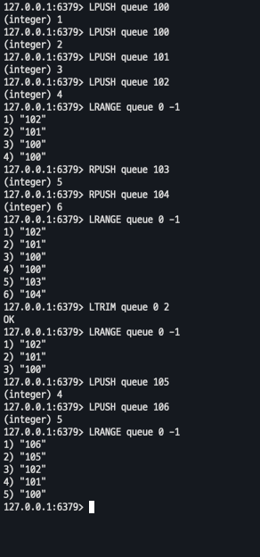
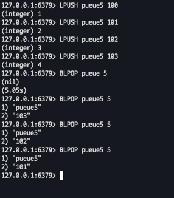

# Lists

---

## in-cli

- LPUSH/RPUSH ,RPOP LPOP  
- LTRIM 
  - 해당 인덱스 값 제외하고 전부다 삭제
  

- BRPOP ,RLPOP 
- BLPOP : BLPOP key [timeout]
  - lists 에서만 사용가능 , 블럭 명령어
  - 해당 값이 채워지지 않은경우 대기하고 있음(타임어택 까지)

  

  
