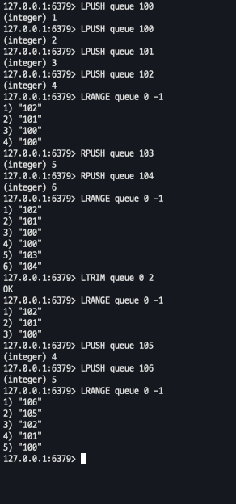
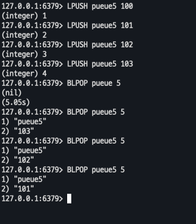
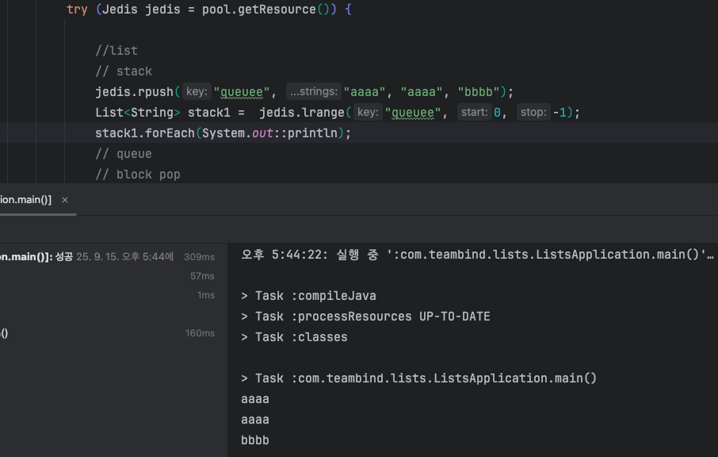
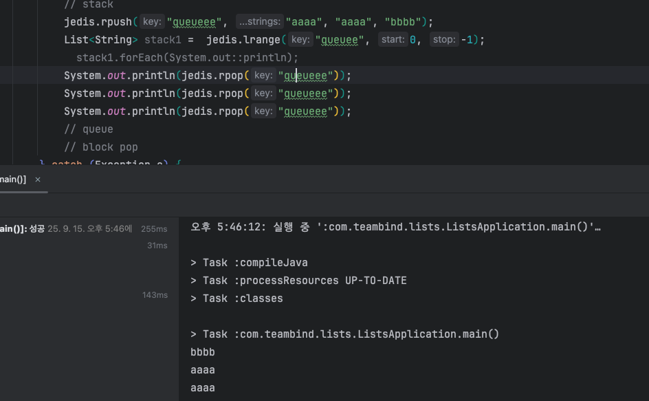
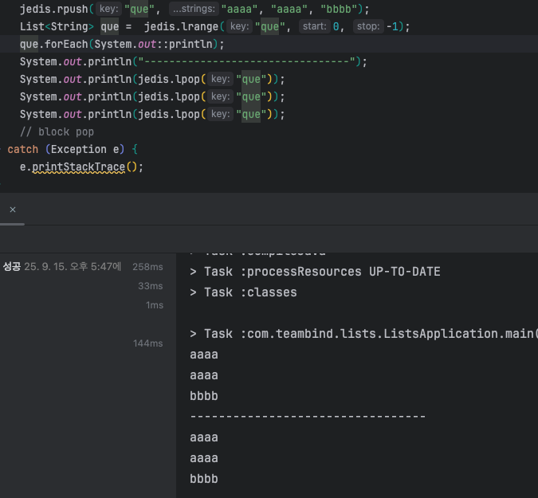
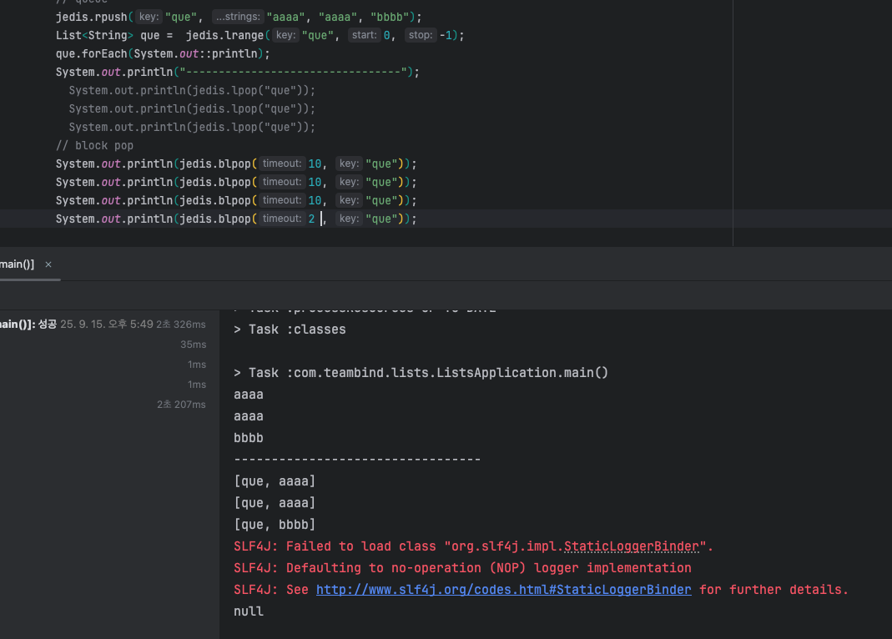

# Lists

---

## in-cli

- LPUSH/RPUSH ,RPOP LPOP  
- LTRIM 
  - 해당 인덱스 값 제외하고 전부다 삭제
  

- BRPOP ,RLPOP 
- BLPOP : BLPOP key [timeout]
  - lists 에서만 사용가능 , 블럭 명령어
  - 해당 값이 채워지지 않은경우 대기하고 있음(타임어택 까지)

  
	
  - 다중 인스턴스(여러 터미널) 에서 같은 키의 블락을 여러개 했을경우 
    - 블락건 순서대로 데이터 반환

  

---

## in JAVA

---

