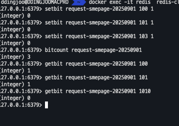
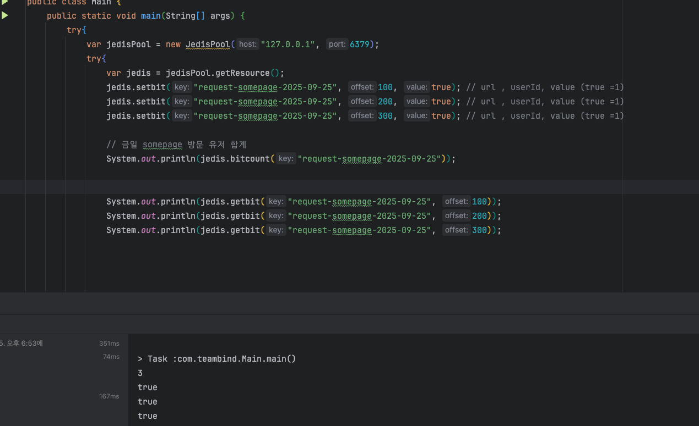

# bitmap

---
- Commands
  - setbit [key] [offset] [value]
    - ex: setbit request-smepage-20250901 100 1
  - getbit [key] [offset]
  - bitcount [key] [start] [end]

  - bitcount 를통한 일일 페이지 방문 통계 데이터 집계

- JAVA

