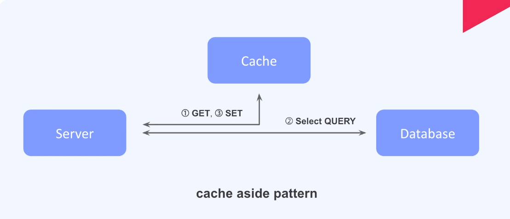

# 캐시

---

### cache aside pattern


```java 
    @GetMapping("/users/{id}/email")
    public String getUserEmail(@PathVariable Long id){
        var userEmailUsersKey = "user:%d:email".formatted(id);

        try{
            Jedis jedis = jedisPool.getResource();
            //1. request to cache
            String userEmail = jedis.get(userEmailUsersKey);
            if(userEmail != null){
                return userEmail;
            }
            //2. else db
            userEmail = userRepository.findById(id).map(User::getEmail).orElse("User not found");
            // 3 cache
            jedis.set(userEmailUsersKey, userEmail);
            // 4. end
            return userEmail;

        }catch (Exception e){
            return e.getMessage();
        }

    }
```

#### *다시보자 TTL 또 확인하자 TTL*


--- 

## 실습
- 각 4회 요청 
  - 캐시 사용 X

    - 디비에 4회 요청 

  - 캐시 사용 
  
    - 디비에 1회 요청 


---
