## InMemory Database
- 실습 환경    docker container 
- docker exec -it redis redis-cli
- 
- redis : 
  - Remote Dictionary Server , in-memory, ket/sub
  

  - inmemory database
    - 빠른 응답속도, but 가격이 비쌈
    - 휘발성 데이터임
  - Persistent on Disk // 디스크에 백업
    - RDB(Snapshot) (기본 설정)
      - 특정 시점의 데이터베이스를 디스크에 저장 
      - 스냅샷 과정 자체가 포크 기반 -> 메모리 사용량 급증
    
    - AOF(Append Only File)
      - 데이터 쓰기 작업 명령어를 백업
      - 명령어 만을 백업 하니까 -> 복구의 용의
      - disk I/O 가 자주 일어 나니까 성능 저하 
    
	- Data types 
      - 다양한 타입 지원
      - String, List, Set, Hash, Sorted Set, HyperLogLog, BitMap
      
    - Single Thread
      - 싱글쓰레드 기반 프로세스 
      - 락을 사용하지 않아도 일관성 보장 가능
      - ... IO 가 급증하면..? inMemory DB 라서 빠른 속도로 커버(초당 10만건) 
      - Redis 공홈에서도 알고리즘 복잡도 표서 O(n) 도입시 좀 고려 해야됨.
    
	- Multi Thread
      - Network I/O 에 관해서는 멀티 쓰래드 사용  but  작업은 단일 쓰래드로 IO만 멀티

- 활용 사례 
  - cache server
  - session server 
  - message queue (Pub/Sub) // message broker로의 작동도 가능 
  - Geospatial index // 빠른 응답 속도 -> 내 주면 gps 어쩌구 저쩌구 그거
  - leader board
    

---

### REDIS - cli 
- 기본적인 데이터 삽입/조회
  - set key value
  - get key
  - del key
  - keys *

- redis-cli monitor
	- monitor : 명령어 기록 모니터 
    
    - redis - banchmark(성능 테스트) 
  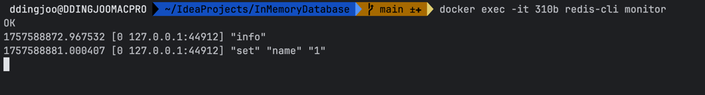
  
      - 초당 92만개 정도 처리 가능
    - slowlog get : 10ms 이상 걸린 명령어 보여줌
      - format 
        - id
        - 실행시간
        - 수행시간
        - 명령
        - client ip/port
        - client name 

	- info
      - 버전, 메모리 ㅈ정보, 세션 정보 등등... 
      - 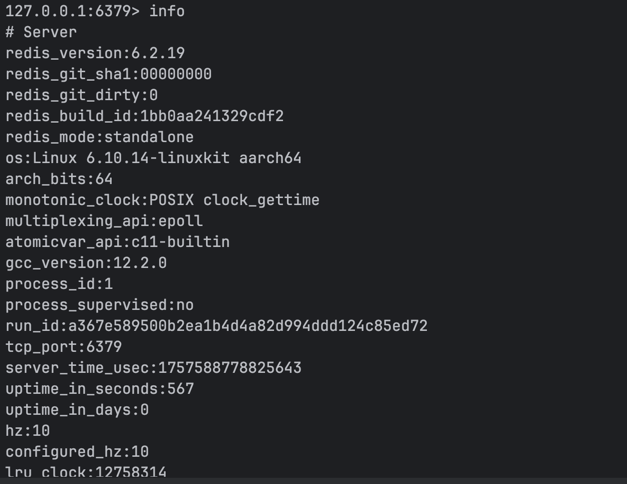
    - docker exec -it [constainer name] redis-cli --stat
      - 메모리 사용량, 사용률, 블락 횟수 등등 정보 초당 업데이트해서 보여줌
    - select [db index]
      - db index : 0 ~ 15 // 논리적인 데이터 베이스 파티션 

- redis insight 
  - GOAT -> GUI

### DATA Types

- Key/ Value  가 기본 구성 
  - Key : binary and Text string
    - 숫자 , 문자 , 특문 지원 512MB 까지 설정 가능 
  - Value : binary and Text string
    - Strings Lists , Sets, Sorted Sets, Hashes, Bitmaps, Geospatial... 등등 올 수 있음 
    - 

---

### Strings Type
- 가장 기본적인   Data type ,
	- 기본적으로 바이너리 저장, 512MB까지 저장 가능
      - 이미지, 직렬화된 데이터(json) 등등 저장 가능 
    - 증가 감소에 대한 원자적 연산가능
      - increase/decrease 

- command 
  - SET ,SETNX (O(N))
    - 벨류가 있는경우 -> SET
    - 벨류가 없는 경우 -> SETNX (NX -> If NOT EXISTS) 
  
  - GET , MGET (O(N))
    - GET, MGET(Multiple GET)
 
  - INCR ,DECR
    - 증가/감소 원자적 계산
  
  - DEL [key] / UNLINK [key]
    - 키 데이터 삭제 
    - DEL : 동기적 삭제 : 삭제 완료까지 버퍼링 
    - UNLINK : 비동기적 삭제  : 삭제 요청후 알빠누 빠이 < 리스트 같은 데이터가 큰 객체 삭제할때 사용 
    
  - *TTL ,  EXPIRE*
    - TTL [key] : 남은 만료시간 체크 
    - EXPIRE [KEY] [SECOND] : 만료시간 설정 (TTL 설정)

  - MEMORY USAGE 
    - 메모리 적재 량 확인 
    
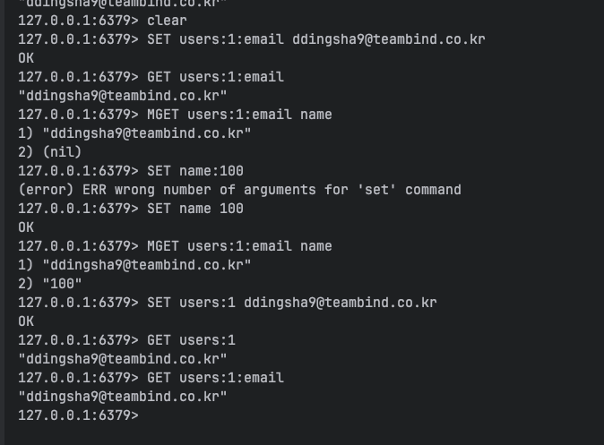
- users:1:email > 이런식으로, 여러 정보를 키에 같이 저장하는 경우가 많음
- 문법적 강제는 아닌 관행
- MGET < - 여러 키값을 한번에 가져와야할때 혹은 배치 작업을 할때 성능상 이득을 취할 수있음.

- 원자적 증/감 실습 코드 
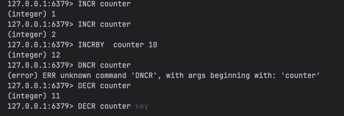
- 원자적 증가가 필요한 이유 : 
  - 여러 어플리케이션이 count 값을 하나 증가 시킬때 GET ,SET 만 있다면, 
  - GET 호출 시점이랑 SET 호출 시점의 차이 때문에 싱글 쓰레드로 운영되는 레디스에서 덮어쓰기를 할때 의도하지않은 작업이 일어 날 수 있음.
    - ex. 조회수 증가 로직을 설정해야할때
      - App1:GET counter  (counter = 1)
      - App2 : GET counter (counter = 1)
      - App2 : SET counter 2 (counter = 2)
      - App1 : SET counter 2 (counter = 2)
        - Redis 저장 기댓값 -> 3 , 실제 -> 2

- TTL 관련 실습 코드 

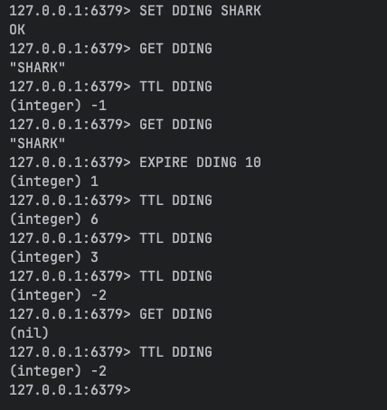

- TTL 설정 X -> -1 , 파기된 KEY(OR 없는 키) -> -2

- MEMORY USAGE
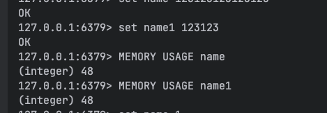

---

### LISTS
- Linked List 구조로 데이터 저장
- Commands
  - LPUSH, RPUSH
  - LPOP, RPOP
  - LLEN 
  - LRANGE
    - 리스트 인덱스 값으로 조회
    - 0 -1 : 전체 조회

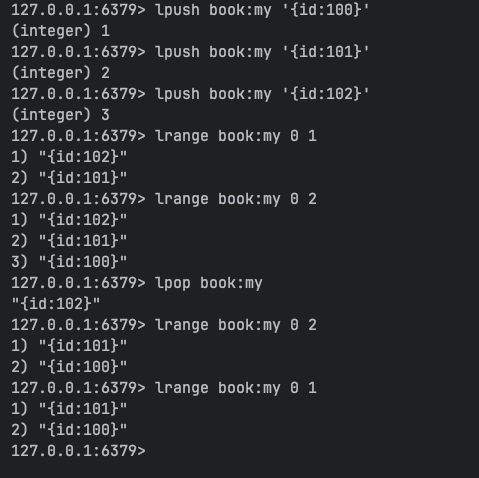

---

### SETS
- Unordered Collection, 유니크 값 보장 , 순서 보장 X
- Commands
  - SADD, SREM
  - SISMEMBER  
    - Set Is Member : 맴버 있는지 조회
  - SMEMBERS
    - 전체 맴버 조회
  - SCARD
    - SETS 에 있는 데이터 수 조회
  - SINTER(O(MN)) // 나머지는 기본적으로 O(N)
    - SINTER : 두개의 SETS에서 공통 데이터 조회

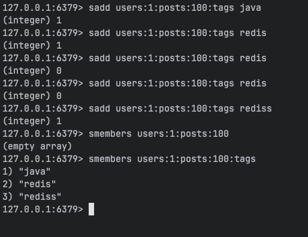

--- 
### SORTED SETS
- ordered collection , 유니크 값 보장, 특정 비교 방식(커스텀 정렬) 가능 
  - leader board, rate limit 
  - leader board, rate limit 에서 사용

- Commands
  - ZADD , ZREM
    - zadd [key] [score] [value]
    - zrem [key] [value]
  - ZRANGE
  - ZCARD
  - ZRANK / ZREVERANK
    - 오름차순, 내림차순
  - ZINCRBY
    - 정렬 점수 원자적 증가
    
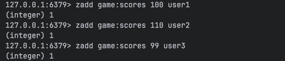
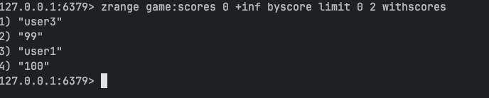

---

### HASHES
- 자바의 HashMap  key ->  { (field ,value) , (field ,value) }
- Commands
  - HSET /, HGET , HMGET , HGETALL
    - hset [key] [field] [value]
    - hget [key] [field]
    - hgetall [key]
  - HDEL
  - HINCRBY
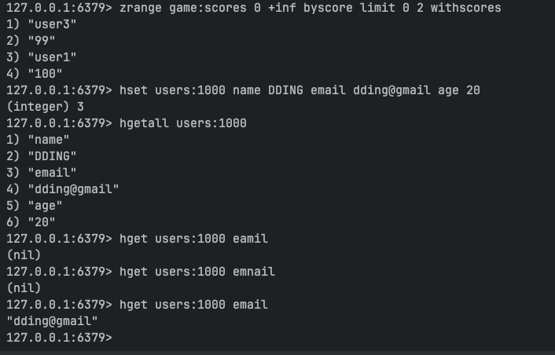
