# Strings 

## 실습

--- 

### INIT

- gradle 초기 import문

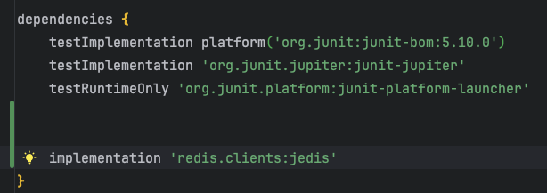

- main에서의 사용 (try문은 .cloes() 하려고   스코프를 만든것 마지막에 .close() 하면댐

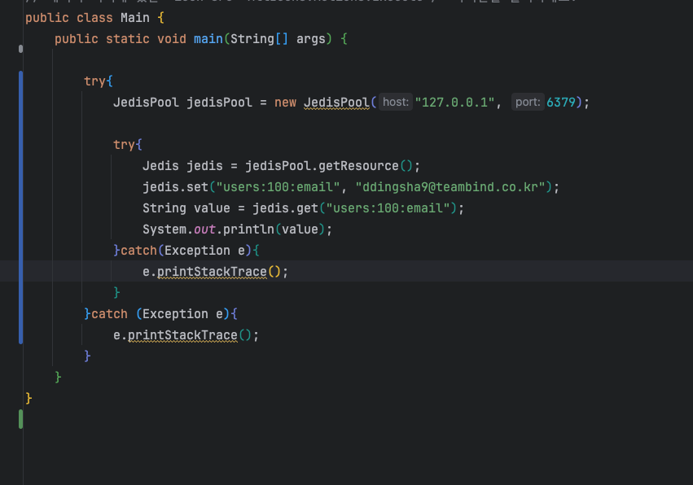

- 결과

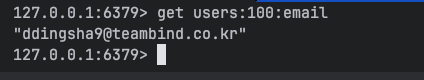
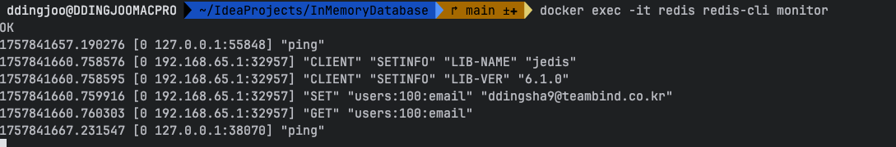

---

### MGET 
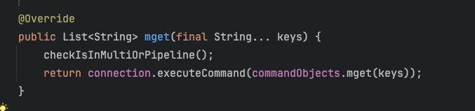
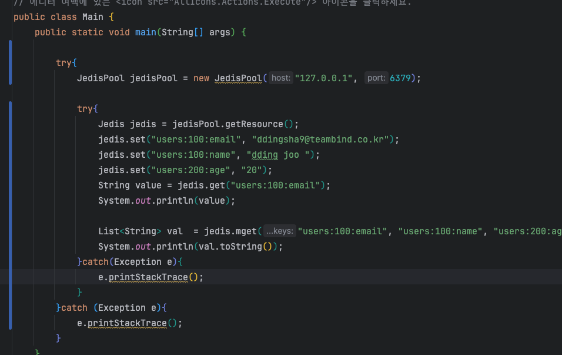

- 결과 
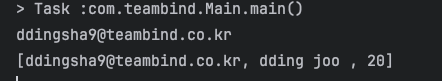

---
### INCR

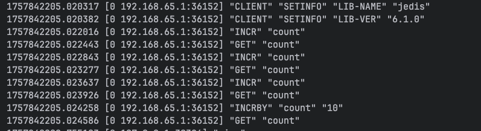

---
### Pipelining
- 배치 처리를 해서 RTT 성능 저하 방지
- Jedis 에서 제공하는 파이프 라인 객체 사용 

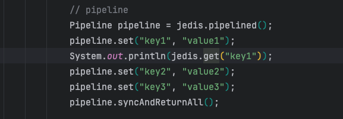
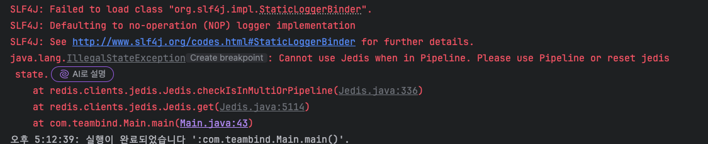

- 올바른 사용 시

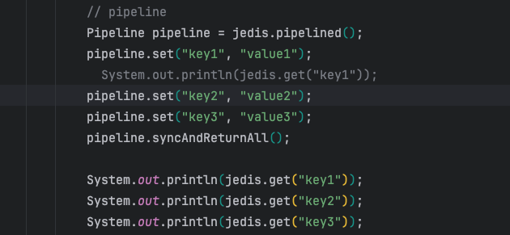
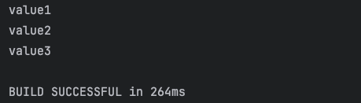
